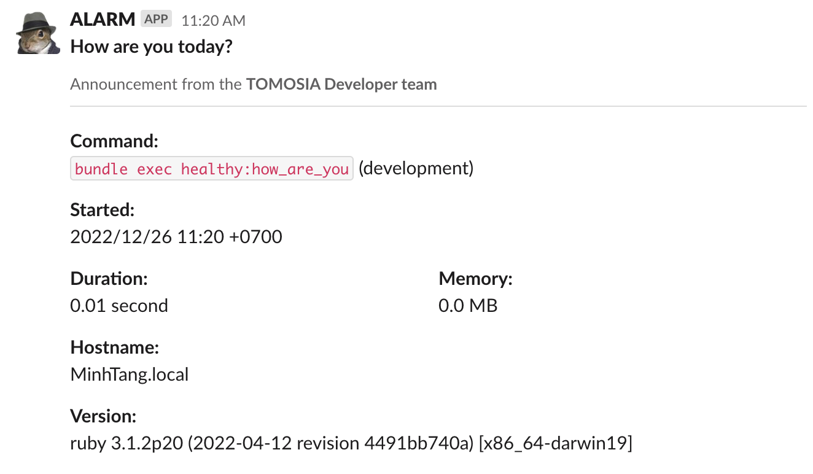

_A simple wrapper to monitoring your project and pushing notifications to Slack._



## Installation

Add this line to your application's Gemfile:

```ruby
gem 'slack_alarm', git: 'git@github.com:TOMOSIA-VIETNAM/slack_alarm.git'
```

And then execute:

    $ bundle install

Or install it yourself as:

    $ gem install slack_alarm

## Usage

```ruby
SlackAlarm.perform(
  description: 'Service get started',
  cmd: 'bundle exec slack_alarm:welcome',                           # Optional
  context: 'Announcement from the *TOMOSIA\'s Developer team*',     # Optional. Override setting configuration
  username: 'MONITOR',                                              # Optional. Override setting configuration
  context: 'How are you today?',                                    # Optional. Override setting configuration
  avatar: ':rotating_light:',                                       # Optional. Override setting configuration
  hostname: `hostname`,                                             # Optional. Override setting configuration
  ruby_version: `ruby -v`,                                          # Optional. Override setting configuration
) do
  # Put your code here
end
```

## Configuration

_Create config file:_

```ruby
# For Rails app: config/initializers/slack_alarm.rb

SlackAlarm.configure do |config|
  config.webhook_url  = 'YOUR WEBHOOK URL'
  config.channel      = 'YOUR CHANNEL'
  config.username     = 'YOUR USERNAME WANT TO DISPLAY ON MESSAGE'
  config.avatar       = 'AVATAR SLACK'
  config.context      = 'CONTENTS OF SUB-DESCRIPTION'
  config.hostname     = 'HOSTNAME COMMAND IN LINUX. Ex: `hostname`'
  config.ruby_version = 'RUBY VERSION. Ex: `ruby -v`'
end
```

##### webhook_url

*String, required*

The Incoming WebHook URL on Teams.

>To get the `webhook_url` you need
>go to https://slack.com/apps/A0F7XDUAZ-incoming-webhooks
>choose your team, press configure
>in configurations press add configuration
>choose channel, press "Add Incoming WebHooks integration"

##### channel

*String, required*

Channel name to receive notifications.

##### username

*String, optional*

Username want to display on message. _Default: Slack Alarm_

##### avatar

*String, optional*

Avatar want to display on channel. _Default emoji: :squirrel:_

##### context

*String, optional*

Additional content for the description

##### hostname

*String, optional*

Execution server name

##### ruby_version

*String, optional*

Current ruby version

## Development

After checking out the repo:

- Run `bin/setup` to install dependencies.
- Run `bin/console` to testing and debugging
- Run `make setup` to install the gem and test it before publishing
- Run `make remove` to uninstall gem after run `make setup`
- Run `make run` to testing code

## Contributing

If there is any thing you'd like to contribute or fix, please:

- Fork the repo
- Add tests for any new functionality
- Make your changes
- Verify all new & existing tests pass
- Make a pull request

## Contributors

- **Nguyễn Xuân Tài - tai.nguyen@tomosia.com**
- **Tăng Quốc Minh - minh.tang1@tomosia.com**

## License

The gem `alarm_slack` is copyright **TOMOSIA VIET NAM CO., LTD**. It is free software, and may be redistributed under the terms specified in the [LICENSE](https://opensource.org/licenses/MIT).

## About TOMOSIA VIET NAM

A company that creates new value together with customers and lights the light of happiness


**[ 共に ] [ 幸せ ] [ 灯す ]**

お客様と共に新たな価値を生み出し幸せの明かりを灯す会社、トモシア
